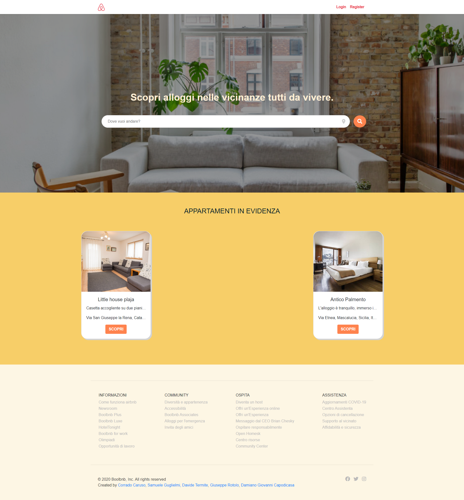

<h1 align="center"><a href="https://corradoct.github.io/BoolBnb/" target="_blank">BoolBnb</a></h1>

Complete Laravel application based on Airbnb

## Homepage

## Search

## Register

## Login

## Dashboard

## Show

## Create

## Edit

## Messages

